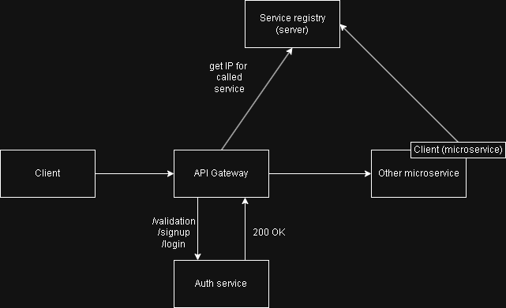

# CV submit organizer
Project is in progress status so many things might be unfinished, bugged or not quite good with common good programming practices.
## Overview
The goal of this app is to mainly character of learning things - especially:
- how to deal with microservices
- following Hexagonal Architecture (ports & adapters) and DDD concepts

Also, it has the goal to make possibility to have an organizer/manager for own CVs and be able to set the status of potential recruitment.

## Technology stack
- backend
    - development
        - Java 21
        - maven
        - Spring Boot 3.4
            - Spring Data JPA
            - Spring Cloud
            - Spring Security
        - lombok
        - flyway (dev DB versioning)
        - PostgresSQL 14.4
        - MailDev - imitates mailbox
    - testing
        - JUnit 5 (unit tests)
        - TestContainers (integration tests)
- deployment
    - Docker

Future possible technologies:
- frontend
    - Angular (latest)
- deployment
    - Kubernetes
    - CI/CD as GitHub Actions
    - Swagger (to auto-documentation)
- architecture
  - change to Event sourcing architecture
## Architecture
Main concepts used in application is hexagonal architecture and Domain Driven Design and microservices.

Very basic theoretical flow:

## Features

# User
- registration user
- verification email user
- login user
- modification email user
- validation user token (using JWT)

# Application job
- adding new application job
- modification job
- deleting job
- retrieve all user jobs (via pagination)

### SonarQube summary

https://sonarcloud.io/project/overview?id=rj-public_rj-public
